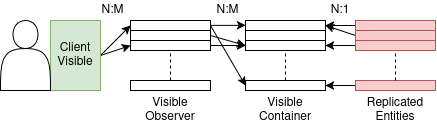

# bevy_replicon_visible_sets

An alternative to `bevy_replicon`'s high-level Visibility Rules API, with Potentially Visible Sets (PVS).
Works by relating entities inside of `VisibleContainer`s, which can be visible to `VisibleObserver`s. 
Clients in turn use `ClientVisible` to insert `VisibleObserver`s.

Simplified diagram of components at play:

Essentially a glorified 3-layered N:M relationship manager that propagates `VisibleIn` entities upwards, using Bevy's mutation check mechanisms.

## Features

- [x] Visibility Rules apply client entities
- [x] Always Visible entities
- [ ] Visibility Layers
- [ ] Component Visibility

## Limitations

Because it is fresh off the oven and other reasons:

- memory cost will scale linearly in the server, as *ALL* replicated entities need to be saved in `ClientVisibility`
- no marking an entity always visible to some clients (yet)
- no component visibility rules (yet).
- not well tested + error prone
- no benching

## Compatibility

| `bevy` | `bevy_replicon` | `bevy_replicon_visible_sets` |
|--------|-----------------|------------------------------|
| 0.19   | 0.41            | 0.0.1                        |

## License

Dual-licensed under either ([MIT License](LICENSE-MIT) or ([Apache License, Version 2.0](LICENSE-APACHE) at your option.

Unless you explicitly state otherwise, any contribution intentionally submitted for inclusion in the work by you, as defined in the Apache-2.0 license, shall be dual licensed as above, without any additional terms or conditions.
